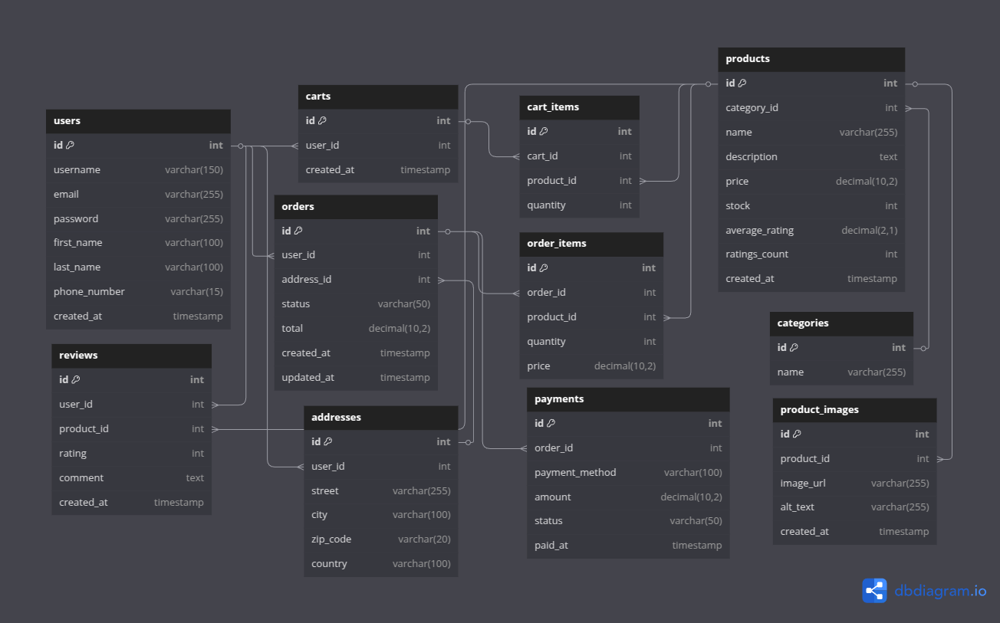

# Project Planning

## 1. Introduction

This document outlines the planning process for the backend of the e-commerce shop project. The goal is to document the initial design decisions, MVP scope, and future considerations for the backend API.

## 2. Project Goal

Build a minimum viable product (MVP) for an online shop that allows users to register, browse products, add items to a cart, place orders, make payments, and review products.

## 3. MVP Scope

The MVP will include:
- User registration and authentication
- Product browsing by category
- Shopping cart functionality
- Order creation and order tracking
- Payment processing (simulated)
- Product reviews

## 4. Technology Stack

- **Backend:** Django (Python)
- **Database:** PostgreSQL
- **Containerization:** Docker

## 5. Database Design

The following ERD was created in dbdiagram.io and shows the current database design:

### Tables Overview

- `users`: Stores user information.
- `categories`: Product categories.
- `products`: Product details.
- `product_images`: Multiple images per product
- `orders`, `order_items`: Orders and their items.
- `carts`, `cart_items`: Shopping cart and its items.
- `payments`: Payment information for orders.
- `reviews`: User reviews of products.
- `addresses`: Addresses for users and orders

## 6. Future Considerations

Potential future features and improvements:
- Product tags (for better filtering and search)
- Advanced order/payment status tracking (with separate reference tables)
- Discount codes and promotions
- Wishlists and saved items
- Parcel locker/pickup point support

## 7. Frontend

The frontend will be created in a separate repository using React, after completing the backend MVP for this project.  
The backend will provide a REST API for integration.  
The frontend repository will include its own planning and documentation.

---

_Last updated: 2025-06-14_